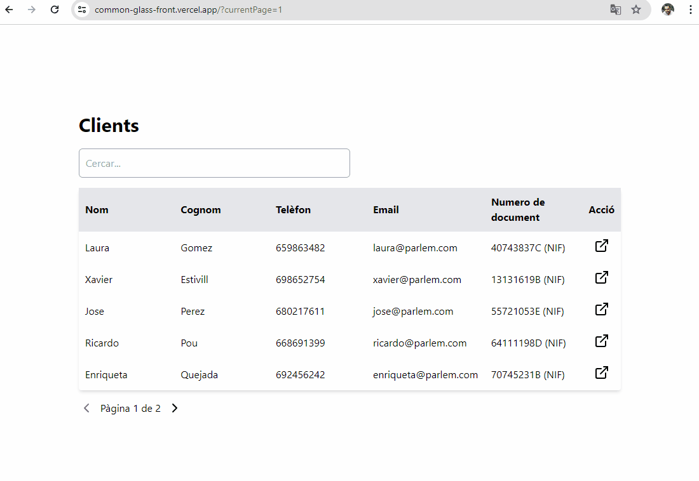

# Frontend Coding Test

Coding test - Vue 3 + TypeScript + Vite + Vue Router + Tailwind CSS


:computer: [Live Demo](https://common-glass-front.vercel.app/)




## Llibreries addicionals

- Vue Router - Per a la gestió de les rutes
- Tailwind CSS - Per a la gestió de l'estil de la web
- Axios - Per a la gestió de les crides a l'API

## Notes & Features

- Components abstractes per a una millor reutilització
- Funcionalitats addicionals com la paginació i la cerca dins la taula
- Estat de la paginació gestionat a la URL amb query params


## Dev Notes
Degut a la senzillesa de la tasca, he optat per utilitzar Vue 3 amb TypeScript i Vite per a la creació de la solució. He afegit Vue Router per a la gestió de les rutes i Tailwind CSS per a l'estil de la web. He optat per utilitzar Axios per a la gestió de les crides a l'API.
No he utilitzat cap State Management com Vuex o Pinia ja que no era necessari per a la tasca.

## Arrencar el projecte en local

Clonar el projecte

```bash
  git clone https://github.com/jtejederabit/common_glass_front
```

Anar al directori del projecte

```bash
  cd common_glass_front
```

Instal·lar les dependències

```bash
  npm install
```

Iniciar el servidor en mode de desenvolupament

```bash
  npm run dev
```

Construir el projecte

```bash
  npm run build
```

## Base URL

In Dev mode

```bash
  http://localhost:5173
```
